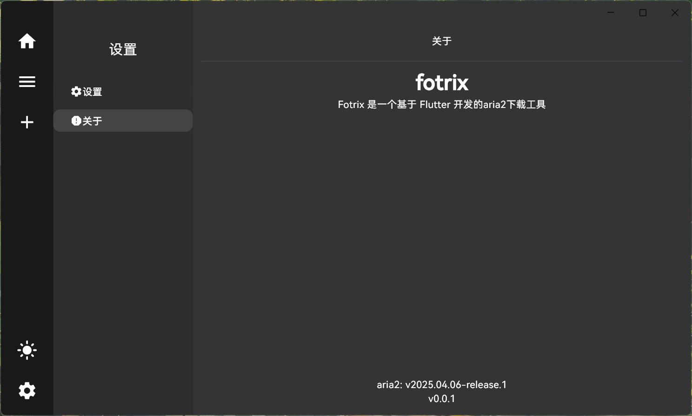

# fotrix

使用 Flutter 开发的一款 aria2 下载器

## Getting Started

### About Page

## Note

暂时仅 Windows 勉强可用，其他平台未进行测试和适配。

    //更新插件
    flutter pub get
    //编译windows平台
    flutter build windows --release

## Todo

### function

-   ✅ 设置修改后更新 aria2
-   下载完成后打开指定文件目录
    -   ✅ 仅限 Windows 平台勉强可用
-   种子文件下载
-   下载任务时托盘图标变化

### bugs

-   ✅ 当任务完成时，程序未刷新状态，点击暂停任务后或直接点击删除任务，导致程序卡住。
-   ✅ 任务名、下载速度等长度超出范围，导致显示异常。
-   ✅ 下载的任务未获取到全部信息时，可能会直接显示为任务完成
-   ✅ 任务错误时程序无提示，且无法删除任务
-   ✅ 重试的任务无法删除下载的文件（疑似解决）
    -   ✅ 多次重试后任务会直接结束，且无本地文件
